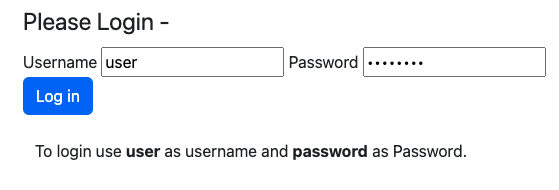
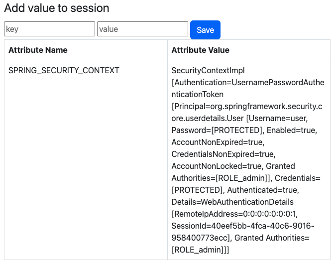
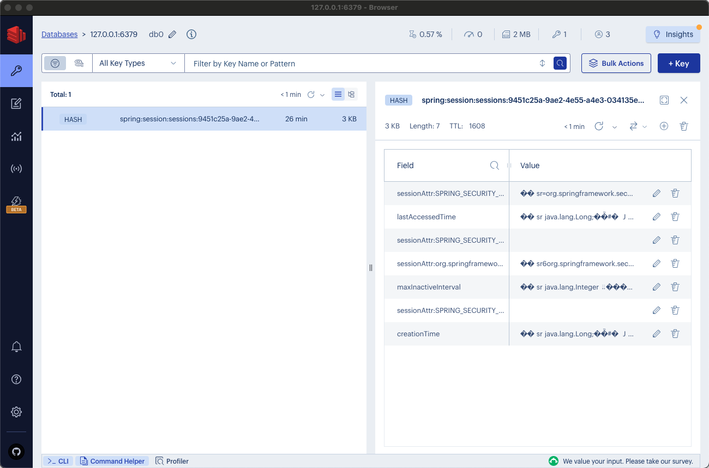
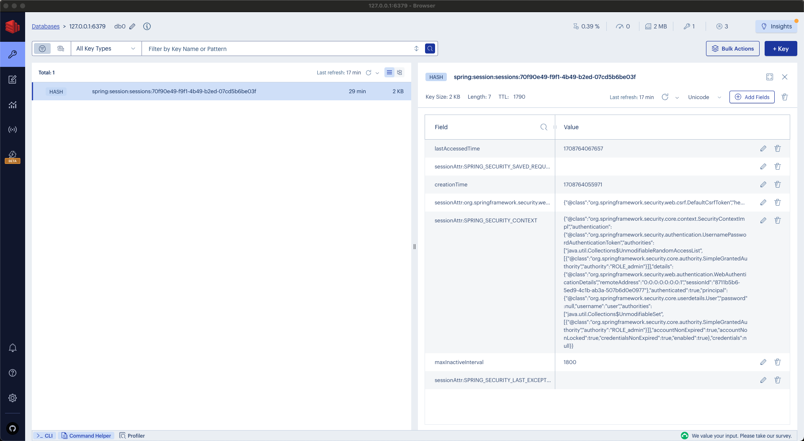
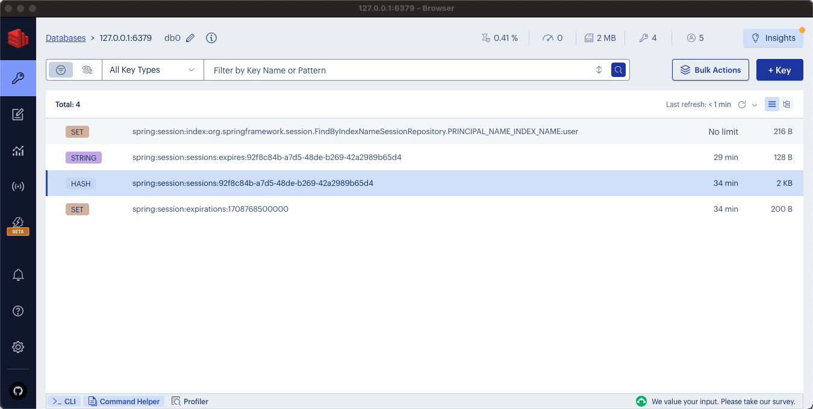

# Using Redis as Session Store - Best practices

This guide outlines essential strategies for session management using Spring and Redis, emphasizing simple, best practices.

The objective is to highlight the benefits of using sessions for analytics.

The repository is organized into branches, each providing functional code for specific scenarios. Branches are sequentially numbered, allowing for a logical progression that increases in _sophistication_.

This guide assumes you have foundational knowledge of the Spring framework and concepts such as Sessions and Session Store.

This guide is designed to focus more on Redis, offering insights and practical knowledge on its functionalities and best practices.
It does not specifically target the Spring framework, although Spring may be referenced in context.
The content aims to enhance understanding and skills in utilizing Redis effectively within various development scenarios.

## Stack
The technology stack utilized for this demonstration encompasses a range of tools and frameworks specifically chosen for their robustness and compatibility.

The components include:
- JDK 17, serving as the foundation with its extensive feature set and performance optimizations.
- Spring Boot 3.2.3, facilitating rapid application development.
    - Spring Security 6.2.2, offering comprehensive security features to protect application access and data.
    - Spring Data Redis 3.2.3, providing seamless integration with Redis for efficient data management and caching solutions.
- Redis Stack 7.2, delivering advanced capabilities for handling data structures (such as JSON), caching, streaming and message brokering with high performance.

## The Code

You can probably find the code used in this first demo everywhere on the internet.
The only thing worth mentioning is the application.yml file where Redis is set as Session store.

```yaml
spring:
  data:
    redis:
      port: 6379
      host: localhost
  session:
    store-type: redis
  security:
    user:
      password: password
      name: user
      roles: ["admin"]
```

The rest of the code is pretty standard for MVC and Security configuration in Spring.

An interesting part is the Security configuration where define which resources requires authentication and which not, as shown below:

```java
    @Bean
    SecurityFilterChain securityFilterChain(HttpSecurity http) throws Exception {
        return http
                .authorizeHttpRequests((authorize) -> authorize
                        .dispatcherTypeMatchers(DispatcherType.ERROR).permitAll()
                        .requestMatchers(PathRequest.toStaticResources().atCommonLocations()).permitAll()
                        .anyRequest().authenticated()
                )
                .formLogin((formLogin) -> formLogin
                        .loginPage("/login")
                        .permitAll()
                )
                .logout((logout) -> logout
                        .permitAll()
                )
                .build();
    }
```

The code is designed to be self-explanatory, particularly with its clear indentation:
1. All requests require authentication, except those requesting static resources and error handling.
2. Access to the login resource is permitted.
3. Access to the logout resource is also allowed.

## Action

First, Docker will be used to initiate Redis Stack.

```Bash
docker run -d --name=redis-spring-session -p 6379:6379 redis/redis-stack-server:7.2.0-v8
```

Then, the Spring Boot application can be launched either from your IDE or the command line, according to preference.
Upon completion, the following link should be accessed in a web browser:
- [http://localhost:8080/home](http://localhost:8080/home)

The login page will display as follows:



Enter `user` as the username and `password` as the password, then click the `Log in` button.

The next page will display a list of session attributes:




Up to this point, everything should be working correctly. Now, let's examine the data stored in Redis.

RedisInsight can be downloaded for free from the specified website:

- [https://redis.com/redis-enterprise/redis-insight/](https://redis.com/redis-enterprise/redis-insight/)

After installation, launch RedisInsight and connect it to the Redis instance using localhost and port 6379.

The view should resemble the following:



One key will be associated with the Spring Session ID, encompassing the session along with all its attributes.
Initially, the details may not be entirely clear.
It may be possible to infer the class of a specific attribute and some of its properties.
This lack of clarity is due to the attributes being stored in a binary serialization format, making them not fully readable.

To identify the user associated with a session, a closer inspection of its values is necessary.
This task remains kind of manageable with a single session. However, with hundreds or thousands of sessions, locating a specific user's session becomes _challenging_.
The session data may require a more accessible format or improved serialization to facilitate better analytics.

Addressing this need for enhanced session data representation will be among the initial improvements in the next section.

## Redis Serializer

In the forthcoming section, the focus will be on adopting an alternative session serializer that enhances our ability 
to pinpoint the user linked to a specific session by allowing a more detailed analysis of the session values. 
The JSON serializer emerges as a popular choice for this task. 
By storing session attribute values in JSON format, it significantly improves the readability and interpretability of the data.

Implementing this change requires the development of a dedicated class tailored to this new session configuration. 
This class will serve the purpose of defining how session attributes are serialized into JSON format, 
ensuring that the data is both easily accessible and comprehensible. 
Furthermore, a RedisSerializer configured to handle JSON serialization will need to be declared as a Spring Bean, as described below:

```Java
@Configuration
public class SessionConfig implements BeanClassLoaderAware {

    private ClassLoader loader;

    @Bean
    public RedisSerializer<Object> springSessionDefaultRedisSerializer() {
        return new Jackson2JsonRedisSerializer(objectMapper(), Object.class);
    }

    private ObjectMapper objectMapper() {
        ObjectMapper mapper = new ObjectMapper();
        mapper.registerModules(SecurityJackson2Modules.getModules(this.loader));
        return mapper;
    }

    @Override
    public void setBeanClassLoader(ClassLoader classLoader) {
        this.loader = classLoader;
    }

}
```

Multiple `RedisSerializer` options exist for different use cases.
For insights on the best option for your specific needs, refer to the performance tests conducted, which are accessible at the following GitHub repository:
- [https://github.com/foogaro/redis-spring-jpa-hibernate/blob/main/serialization-tests.md](https://github.com/foogaro/redis-spring-jpa-hibernate/blob/main/serialization-tests.md)

This setup facilitates the seamless integration of the new serialization method into the existing framework, 
thereby enabling the desired behavior of more transparent session data management.

After clearing all previously stored sessions in Redis, the application can be executed once more, and login can be performed as described earlier.
At this stage, the session will be generated as normal, but the values of its attributes will be in JSON format, as illustrated below:



The readability of session data has greatly enhanced, permitting the use of a JSON parser for improved navigation of the JSON structure.
Nonetheless, manual effort is still required, and identifying the user associated with the session remains a simple process. The Redis Integration provides an annotation named `@EnableRedisIndexedHttpSession`, which introduces indexing capabilities to the session, as indicated by its name. Consequently, this annotation should be added to the `SessionConfig` that was implemented earlier, as shown below:


Readability has been greatly enhanced, enabling the use of a JSON parser to more effectively navigate the JSON structure.
Nonetheless, a manual effort is still required, and locating the user associated with a session remains a challenging and tedious process.

## An even better Redis integration

Redis integration provides an annotation named `@EnableRedisIndexedHttpSession`, which, as the name implies, introduces indexing capabilities to the session.
Thus, this annotation should be added to the `SessionConfig` that was previously implemented, as shown below:

```Java
@Configuration
@EnableRedisIndexedHttpSession
public class SessionConfig implements BeanClassLoaderAware {

    private ClassLoader loader;

    @Bean
    public RedisSerializer<Object> springSessionDefaultRedisSerializer() {
        return new Jackson2JsonRedisSerializer(objectMapper(), Object.class);
    }

    private ObjectMapper objectMapper() {
        ObjectMapper mapper = new ObjectMapper();
        mapper.registerModules(SecurityJackson2Modules.getModules(this.loader));
        return mapper;
    }

    @Override
    public void setBeanClassLoader(ClassLoader classLoader) {
        this.loader = classLoader;
    }

}
```

Once more, clear the Redis session store, start the application, and proceed with the usual login process.
The data in Redis will appear as follows:



Three additional keys have been added to the Redis session store to enhance session management and expiration tracking:
1. `spring:session:index:org.springframework.session.FindByIndexNameSessionRepository.PRINCIPAL_NAME_INDEX_NAME:user` embeds the username within the key's structure, directly associating it with the session ID. This facilitates the identification of user sessions, making it straightforward to determine which sessions belong to which users.
2. `spring:session:sessions:expires:92f8c84b-a7d5-48de-b269-42a2989b65d4` serves as a mechanism to monitor when sessions are due to expire. By tracking the expiration timeline of each session, the system ensures timely session management and resource cleanup.
3. `spring:session:expirations:1708768500000` offers a timestamp detailing the exact moment a session is set to expire. This precise timing allows for efficient session expiration handling, ensuring that sessions are only active for their intended lifespan.

These improvements enhance the session management system, providing more precise control over session durations and user authentication statuses in a distributed setting.
They facilitate the identification of authenticated users and the sessions they are logged into, accommodating scenarios where a user may be accessing the system from multiple devices concurrently.

Frequently, stateful applications utilize sessions as a repository for various data elements, such as shopping carts in e-commerce platforms.
This practice is not optimal because it burdens session management systems, which should primarily handle authentication and authorization for improved performance.
Additionally, sessions have expiration times, and it may be necessary to retain certain data, like shopping cart contents, independently.

While traditional databases can segregate such data, Redis offers an efficient alternative given its high performance as a persistent storage solution.

For analytical purposes, it is feasible to link shopping carts to sessions while employing distinct keys and Redis data types, like Hashes or JSON.
This arrangement allows for indexing, enabling administrators to effectively examine sessions, user activities, and shopping cart contents through filtering, searching, and aggregating operations.

Consider the potential to identify all carts with a total value exceeding $1,000 and offer an immediate $100 discount or coupon code if the purchase is completed within 10 minutes.
This strategy enhances user engagement and sales opportunities.

This is real-time analytics.<br/>
This is real-time online sales!
