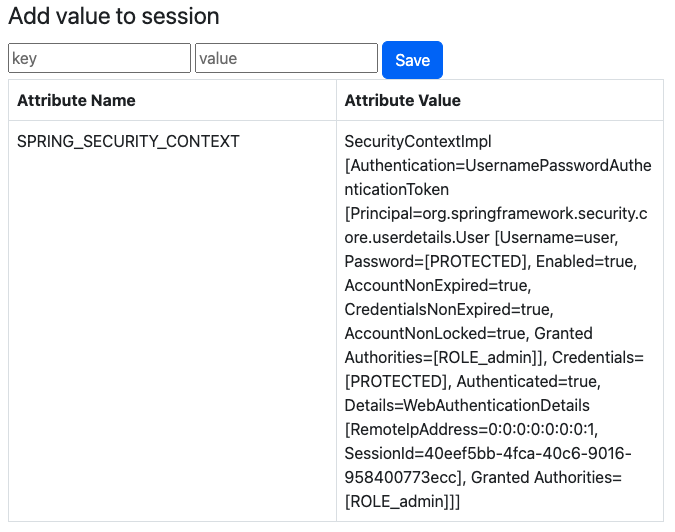
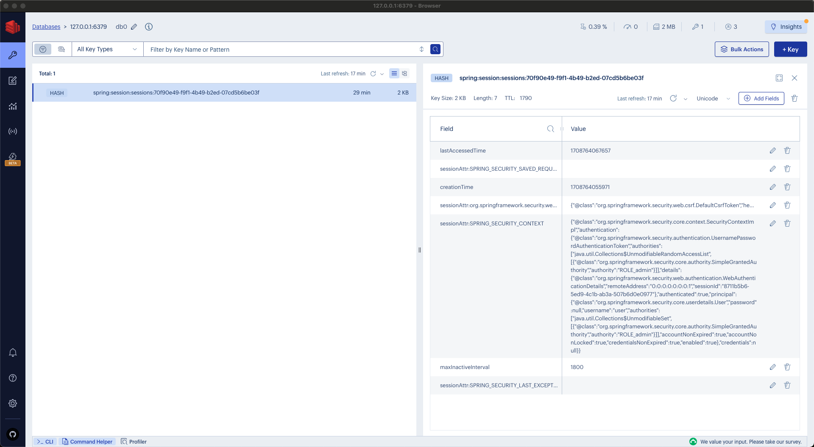
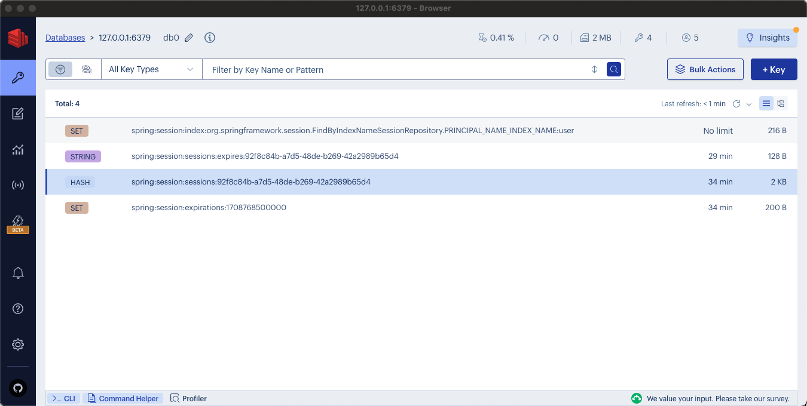

# Redis come Session Store - Best practices

Questo documento si propone di fornire indicazioni e pratiche consigliate per l'impiego di __Redis__ come __Session Store__ all'interno del framework __Spring__.

Obiettivo aggiuntivo è sottolineare i vantaggi dell'uso delle sessioni per l'analisi dati.

È richiesta una conoscenza di base di Spring e dei principi relativi alle sessioni e al Session Store in contesti _Web_.

L'enfasi è posta su Redis, con una panoramica delle sue capacità e delle strategie consigliate per il suo utilizzo.
Pur non focalizzandosi esclusivamente su Spring, il framework può essere occasionalmente citato.
L'obiettivo è potenziare la comprensione e le competenze nell'utilizzo efficace di Redis in diversi contesti di sviluppo applicativo.

## Lo Stack Tecnologico

Lo stack tecnologico utilizzato in questo articolo comprende una gamma di strumenti e framework specificamente selezionati per la loro robustezza e compatibilità.

I componenti includono:
- __JDK 17__, non credo abbia bisogno di particolari presentazioni.
- __Spring Boot 3.2.3__, che facilita lo sviluppo rapido di applicazioni.
  - __Spring Security 6.2.2__, che offre funzionalità di sicurezza complete per proteggere l'accesso alle applicazioni e i dati.
  - __Spring Data Redis 3.2.3__, che fornisce un'integrazione fluida con Redis per una gestione dei dati efficiente e soluzioni di caching.
- __Redis Stack 7.2__, che offre capacità avanzate per la gestione delle strutture dati (come JSON), il caching, lo streaming e il message brokering con alte prestazioni.

## Il Codice

È probabile che il codice utilizzato in questa prima demo sia reperibile pressoché ovunque su internet.
L'unico aspetto degno di nota è il file `application.yml`, in cui Redis è configurato come Session Store.

```yaml
spring:
  data:
    redis:
      port: 6379
      host: localhost
  session:
    store-type: redis
  security:
    user:
      password: password
      name: user
      roles: ["admin"]
```

Il resto del codice è abbastanza standard per la configurazione di __MVC__ e __Security__ in Spring.

Una parte interessante riguarda la configurazione della sicurezza, dove si definiscono quali risorse richiedono autenticazione e quali no, come mostrato di seguito:

```java
    @Bean
    SecurityFilterChain securityFilterChain(HttpSecurity http) throws Exception {
        return http
                .authorizeHttpRequests((authorize) -> authorize
                        .dispatcherTypeMatchers(DispatcherType.ERROR).permitAll()
                        .requestMatchers(PathRequest.toStaticResources().atCommonLocations()).permitAll()
                        .anyRequest().authenticated()
                )
                .formLogin((formLogin) -> formLogin
                        .loginPage("/login")
                        .permitAll()
                )
                .logout((logout) -> logout
                        .permitAll()
                )
                .build();
    }
```

Il codice è progettato per essere autoesplicativo, complice la sua chiara indentazione:
1. Tutte le richieste richiedono autenticazione, ad eccezione di quelle che richiedono risorse statiche e la gestione degli errori.
2. L'accesso alla risorsa di login è consentito.
3. È consentito anche l'accesso alla risorsa di logout.

## Primo ciak 

La prima cosa da fare è dotarsi di Redis Stack per storicizzare e gestire le sessioni.
A tal proposito, verrà impiegato __Docker__ come strumento principale. 

```Bash
docker run -d --name=redis-spring-session -p 6379:6379 redis/redis-stack-server:7.2.0-v8
```

Successivamente, l'applicazione _Spring Boot_ può essere avviata sia dall'_IDE_ che dalla linea di comando, a seconda delle preferenze.
L'applicazione sarà disponibile al seguente link:
- [http://localhost:8080/home](http://localhost:8080/home)

La pagina di login verrà visualizzata come segue:


Inserire `user` come nome utente e `password` come password, quindi fare clic sul pulsante `Log in`.

La pagina successiva mostrerà un elenco degli attributi di sessione:



Fino a questo punto, tutto dovrebbe funzionare correttamente. Ora, esaminiamo i dati memorizzati in Redis utilizzando __RedisInsight__, bellissima applicazione grafica per Redis.

RedisInsight può essere scaricato gratuitamente dal sito seguente sito web:

- [https://redis.com/redis-enterprise/redis-insight/](https://redis.com/redis-enterprise/redis-insight/)

Dopo l'installazione, avviare RedisInsight e collegarlo all'istanza Redis utilizzando localhost e la porta 6379.

I dati in Redis dovrebbero assomigliare alla seguente schermata:


Una chiave sarà associata all'__ID__ di sessione di Spring, comprendendo la sessione con tutti i suoi attributi.
Inizialmente, i dettagli potrebbero non essere del tutto chiari.
E' possibile dedurre e intuire la classe di un attributo specifico e alcune delle sue proprietà.
Questa mancanza di chiarezza, o per meglio dire di leggibiltià, è dovuta al fatto che gli attributi sono stati memorizzati utilizzando un formato di serializzazione binaria, rendendoli non pienamente leggibili.

Quindi, per identificare l'utente associato a una sessione, è necessaria un'ispezione più dettagliata dei suoi valori.
Questo compito rimane gestibile con una singola sessione. Tuttavia, con centinaia o migliaia di sessioni, individuare la sessione di un utente specifico diventa _complicato_.
Per poter analizzare in modo efficace i dati di una sessione, è opportuno che questi siano in un formato più leggibile e accessibile.

La prossima sezione si concentrerà sull'implementazione di miglioramenti finalizzati proprio all'analisi dei dati.

## Redis Serializer

In questa sezione, l'attenzione sarà rivolta all'adozione di un _Serializer_ di sessione alternativo che migliora la nostra capacità di identificare l'utente collegato a una sessione specifica, consentendo un'analisi più dettagliata dei valori della sessione.
In questo, il _Serializer_ per il formato _JSON_ è la scelta più ovvia. Memorizzando i valori degli attributi di sessione in formato JSON, migliora significativamente la leggibilità e l'interpretabilità dei dati.

L'implementazione di questo cambiamento richiede lo sviluppo di una classe ad-hoc, in cui viene definito il Serializer da utilizzare.
A tal propostio, l'integrazione _Spring Data Redis_ fornisce un set di _RedisSerializer_ da poter utilizzare a tale scopo, come mostrato nella seguente implementazione:

```Java
@Configuration
public class SessionConfig implements BeanClassLoaderAware {

    private ClassLoader loader;

    @Bean
    public RedisSerializer<Object> springSessionDefaultRedisSerializer() {
        return new Jackson2JsonRedisSerializer(objectMapper(), Object.class);
    }

    private ObjectMapper objectMapper() {
        ObjectMapper mapper = new ObjectMapper();
        mapper.registerModules(SecurityJackson2Modules.getModules(this.loader));
        return mapper;
    }

    @Override
    public void setBeanClassLoader(ClassLoader classLoader) {
        this.loader = classLoader;
    }

}
```

In questa configurazione è stato scelto il __Jackson2JsonRedisSerializer__, rendendo super facile integrare il nuovo metodo di serializzazione, permettendoci di gestire i dati di sessione in modo molto più chiaro e diretto.

>Esistono diverse opzioni di `RedisSerializer` adatte a vari casi d'uso.
Per ottenere indicazioni sulla migliore opzione per le vostre esigenze specifiche, si rimanda ai test di prestazione effettuati, accessibili nel seguente repository __GitHub__:
>- [https://github.com/foogaro/redis-spring-jpa-hibernate/blob/main/serialization-tests.md](https://github.com/foogaro/redis-spring-jpa-hibernate/blob/main/serialization-tests.md)

Dopo aver cancellato tutte le sessioni precedentemente memorizzate in Redis, l'applicazione può essere eseguita nuovamente e il login può essere effettuato come descritto in precedenza.
A questo punto, la sessione verrà generata come al solito, ma i valori dei suoi attributi saranno in formato JSON, come illustrato di seguito:



La leggibilità è stata notevolmente migliorata, consentendo l'utilizzo di un parser JSON per navigare più efficacemente la struttura JSON.
Tuttavia, è ancora necessario uno sforzo manuale e individuare l'utente associato a una sessione rimane un processo impegnativo e soggetto a errori.

## Un'integrazione Redis ancora _+ mejo_

L'integrazione con Redis offre un'annotazione chiamata `@EnableRedisIndexedHttpSession` che, come suggerisce il nome, introduce la capacità di indicizzazione per le sessioni, che forse è proprio quello che stiamo cercando.

Quindi, questa annotazione dovrebbe essere aggiunta alla `SessionConfig` precedentemente implementata, come mostrato di seguito:

```Java
@Configuration
@EnableRedisIndexedHttpSession
public class SessionConfig implements BeanClassLoaderAware {

    private ClassLoader loader;

    @Bean
    public RedisSerializer<Object> springSessionDefaultRedisSerializer() {
        return new Jackson2JsonRedisSerializer(objectMapper(), Object.class);
    }

    private ObjectMapper objectMapper() {
        ObjectMapper mapper = new ObjectMapper();
        mapper.registerModules(SecurityJackson2Modules.getModules(this.loader));
        return mapper;
    }

    @Override
    public void setBeanClassLoader(ClassLoader classLoader) {
        this.loader = classLoader;
    }

}
```

Ancora una volta, pulisci lo store delle sessioni di Redis, avvia l'applicazione e procedi con il solito processo di login.
I dati in Redis saranno visualizzati come segue:



Nel Redis session store sono stati aggiunti tre nuovi chiavi per migliorare la gestione delle sessioni e il monitoraggio delle scadenze:
1. `spring:session:index:org.springframework.session.FindByIndexNameSessionRepository.PRINCIPAL_NAME_INDEX_NAME:user` include il nome utente nella struttura della chiave, associandolo direttamente all'ID della sessione. Questo facilita l'identificazione delle sessioni degli utenti, rendendo semplice determinare a quali utenti appartengono le sessioni.
2. `spring:session:sessions:expires:92f8c84b-a7d5-48de-b269-42a2989b65d4` permette di monitorare quando le sessioni scadranno. Tracciando il momento di scadenza di ciascuna sessione, il sistema garantisce una gestione tempestiva delle sessioni e la pulizia delle risorse.
3. `spring:session:expirations:1708768500000` fornisce un timestamp che dettaglia il momento esatto in cui una sessione è destinata a scadere. Questo timing preciso consente una gestione efficiente delle scadenze delle sessioni, assicurando che le sessioni siano attive solo per il loro periodo di vita previsto.

Questi miglioramenti potenziano il sistema di gestione delle sessioni, offrendo un controllo più preciso sulla durata delle sessioni e lo stato di autenticazione degli utenti in un contesto distribuito.
Facilitano l'identificazione degli utenti autenticati e delle sessioni a cui sono connessi, adattandosi a scenari in cui un utente potrebbe accedere al sistema da più dispositivi contemporaneamente.

Spesso, le applicazioni _Stateful_ utilizzano le sessioni come contenitore per vari elementi di dati, come carrelli della spesa nelle piattaforme di e-commerce.
Questa pratica non è ottimale perché sovraccarica i sistemi di gestione delle sessioni, che dovrebbero principalmente occuparsi di autenticazione e autorizzazione per migliorare le prestazioni.
Inoltre, le sessioni hanno tempi di scadenza, e potrebbe essere necessario conservare alcuni dati, come il contenuto del carrello della spesa, in modo indipendente.

Sebbene i database tradizionali possano segregare e memorizzare tali dati, Redis offre un'alternativa efficiente date le sue elevate performance come soluzione di archiviazione persistente.

Considera il vantaggio di rilevare carrelli con un totale superiore a 1.000 dollari per offrire immediatamente uno sconto di 100 dollari o un coupon, a patto che il pagamento avvenga entro i prossimi 10 minuti.

Questa strategia può essere arricchita con analisi dettagliate, associando i carrelli alle sessioni degli utenti tramite l'uso di chiavi uniche e sfruttando i tipi di dati Redis come Hashes o JSON, per una gestione dati più efficiente e incisiva.

Queste strutture dati consentono l'indicizzazione, permettendo agli amministratori di esaminare efficacemente le sessioni, le attività degli utenti e il contenuto dei carrelli della spesa attraverso operazioni di filtraggio, ricerca e aggregazione.

All'interno dell'ecosistema Redis, emerge un framework noto come Redis OM, specificatamente progettato per permettere la modellazione degli oggetti di business, offrendo un approccio diretto per ottimizzare le operazioni con Redis.

Redis OM, acronimo di Redis Obecjt Mapping, consiste in un insieme di librerie sviluppate per facilitare l'interazione con Redis attraverso il paradigma della programmazione orientata agli oggetti. La suite di Redis OM semplifica l'utilizzo di Redis attraverso l'astrazione dei comandi diretti in operazioni ad alto livello. È concepita per offrire un metodo di lavoro con Redis più intuitivo e accessibile, trasformando taks complessi in procedure gestibili e dirette.


Consideriamo il seguente carrello della spesa modellato usando le direttive Redis OM:

```Java
@Document
public class Cart {
    @Id
    private String id;
    @Indexed
    @Searchable
    private String userId;
    @Indexed
    private String sessionId;
    @Indexed
    private List<Product> products;
    @Indexed
    private double total;
    private double discount;
    @Indexed
    private long totalProducts;
    @Indexed
    private long totalQuantity;

    //Constructors, getters, setters...
}
```

L'annotazione `@Document` segnala che si tratta di un oggetto JSON memorizzato in Redis. Usando `@Indexed`, si specificano gli attributi da indicizzare;
Redis OM poi assegna automaticamente il tipo di indice appropriato, basandosi sul tipo dell'attributo.
Questo approccio è applicato anche all'oggetto annidato `Product`, definito nel seguente modo:

```Java
public class Product {
    @Id
    private String id;
    @Searchable
    private String title;
    @TextIndexed
    private String description;
    private String thumbnailUrl;
    @Indexed
    private double price;
    @Indexed
    private long quantity;
    @Indexed
    private double total;

    //Constructors, getters, setters...
}
```

L'oggetto Product adotta automaticamente la struttura di Redis JSON, eliminando la necessità di definirla esplicitamente.
Utilizzando l'annotazione `@TextIndexed`, si indica che l'attributo `description` è di tipo testo, permettendo così una ricerca Full-Text. 

Questo processo di modellazione dei dati porta alla generazione automatica del seguente indice in Redis:

```redis
FT.CREATE com.foogaro.dto.CartIdx 
ON JSON 
PREFIX 1 "com.foogaro.dto.Cart:"
LANGUAGE "english"
SCORE "1.0"
SCHEMA
    "$.userId" 			AS userId 		TAG SEPARATOR "|" SORTABLE
    "$.sessionId" 		AS sessionId 		TAG SEPARATOR "|" SORTABLE
    "$.products[0:].title" 	AS products_title 	TEXT WEIGHT 1
    "$.total" 			AS total 		NUMERIC
    "$.totalProducts" 		AS totalProducts 	NUMERIC
    "$.totalQuantity" 		AS totalQuantity 	NUMERIC
    "$.id" 			AS id 			TAG SEPARATOR "|" SORTABLE
```

A questo punto, è necessario configurare le query da eseguire tramite interfaccia, come, per esempio, l'elenco di tutti i carrelli della spesa con un totale che supera un determinato valore. 

Grazie a Redis OM, questo compito è estremamente semplice e richiede solo poche righe di codice:

```Java
    public Iterable<Cart> findAllCartTotalGreaterThan(final double total) {
        return entityStream
                .of(Cart.class)
                .filter(Cart$.TOTAL.ge(total))
                .sorted(Cart$.TOTAL, SortedField.SortOrder.ASC)
                .collect(Collectors.toList());
    }
```

Questo metodo individua tutte le chiavi associate all'oggetto Cart il cui totale è maggiore o uguale (indicato come "ge") al valore specificato, come illustrato di seguito;


Successivamente, nell'interfaccia utente, è possibile applicare facilmente lo sconto necessario per incentivare il cliente a procedere con il checkout del carrello e completare l'ordine.


Lato Redis è possibile verificare gli aggiornamenti utilizzando RedisInsight, come illustrato nella seguente schermata:


Questa strategia potenzia l'engagement degli utenti e le opportunità di vendita.

Questo è real-time analytics.<br/>
Questo è real-time online sales!
